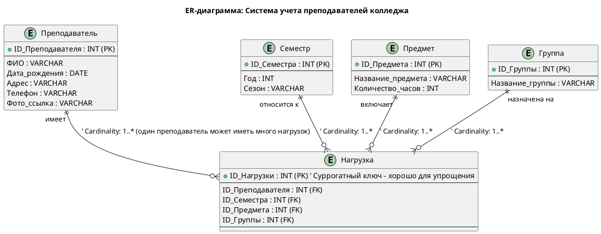

Отличная и очень полная подборка материала! Видно глубокое понимание темы. Материал хорошо структурирован и содержит все ключевые аспекты, касающиеся требований, методологий разработки, организации работы команды, систем контроля версий, интеграции модулей, стандартов кодирования, UML, тестирования и документации.

Вот несколько комментариев и предложений по вашему тексту, а также детальный анализ представленных диаграмм:

---

### Общие комментарии по тексту:

1.  **Полнота и Структура:** Материал охватывает широкий спект спектр тем в разработке ПО, от высокоуровневых принципов до конкретных технических аспектов. Структура логична, каждая секция начинается с определения и затем раскрывает детали.
2.  **Ясность и Точность:** Большинство определений и описаний очень точны и ясны.
3.  **Примеры:** Хорошо, что приведены примеры для многих концепций (например, для типов требований, методологий, мер и метрик), это делает материал более понятным и применимым.

### Конкретные комментарии по секциям:

*   **1. Требование... / 2. Уровни требований:** Очень четко и понятно. Классификация и иерархия требований описаны верно.
*   **3. Методологии и стандарты работы с требованиями:** Хорошо раскрыты основные методологии и их применимость. Стандарты указаны корректно.
*   **4. Современные принципы разработки ПО:** Список современных принципов актуален. Часть, которая идет после "Технология разработки программного обеспечения", описывает скорее **модели жизненного цикла ПО** (итерационная, спиральная, гибкие, бережливая), а не только "принципы" в том же смысле, что Agile-манифест или KISS. Это не ошибка, просто стоит отметить разницу в категориях.
*   **5. Методы организации работы в команде:** Список методов (Scrum, Kanban и т.д.) относится к **практикам/методам организации работы**. Пункты 1, 2, 3 ("Равноправная основа", "Руководитель", "Старшие и младшие") описывают скорее **структуры команды** или **модели управления**, что также важно, но несколько иная категория. Можно было бы выделить их в отдельный подраздел "Структуры команд" или "Модели управления командами".
*   **6. Системы контроля версий:** Очень хорошее и подробное описание СКВ, их особенностей и типов.
*   **7. Подходы к интегрированию модулей:** Отличный раздел, подробно описаны как классические, так и современные подходы к интеграции. Примеры очень полезны.
*   **8. Стандарты кодирования:** Четко, полно, приведены хорошие примеры.
*   **9. Описание требований: UML / 10. Диаграммы UML:** Хорошее введение в UML, ключевые понятия и область применения. Важно, что вы подчеркнули, что UML — это язык визуализации, а не программирования.
*   **11. Описание и оформление требований (спецификация):** Структура SRS описана правильно.
*   **12. Анализ требований и стратегии выбора решения:** Полное описание процесса анализа, методов и стратегий выбора решений.
*   **13. Цели и задачи, и виды тестирования:** Очень подробный список видов тестирования. Задачи и цели также сформулированы верно.
*   **14. Стандарты качества программной документаций:** Важный раздел, хорошо освещены критерии качества и соответствующие стандарты.
*   **15. Меры и метрики:** Отличное объяснение различий между мерами и метриками, а также подробные примеры метрик по категориям.
*   **16. Тестовое покрытие:** Четкое определение и виды покрытия, объяснение важности.
*   **17. Тестовый сценарий:** Правильная структура и типы тестовых сценариев.

---

### Анализ диаграмм:

Теперь перейдем к вашим диаграммам, которые являются практическим применением теоретических знаний.

**Задание 2.5 - Диаграмма потоков данных (DFD)**

**Контекстная DFD (Уровень 0):**

```plantuml
@startuml
title DFD Уровень 0: Система учета преподавателей

actor Администратор as admin
'database "База данных" as db - Не внешняя сущность для DFD 0
'file "Файловое хранилище" as storage - Не внешняя сущность для DFD 0

rectangle "Система учета преподавателей" as system_process { ' Процесс уровня 0 обычно представляется одним блоком
  (Система учета преподавателей)
}

admin --down-> (Система учета преподавателей) : Данные преподавателя\n(ФИО, контакты, фото)
admin --down-> (Система учета преподавателей) : Нагрузка\n(предметы/группы)
admin --down-> (Система учета преподавателей) : Запрос отчетов
(Система учета преподавателей) --up--> admin : Готовые отчеты\n(PDF/Excel)
(Система учета преподавателей) --up--> admin : Уведомление об успешном добавлении преподавателя ' Добавил из вашего примера тестового сценария

@enduml
```

**Комментарии к вашей версии DFD Уровня 0:**

*   **Сущности "База данных" и "Файловое хранилище":** В DFD контекстного уровня (Уровень 0) не должны присутствовать внутренние хранилища данных (База данных, Файловое хранилище). Уровень 0 показывает только **внешние сущности** (источники и приемники данных, которые находятся за пределами системы) и один единственный процесс, представляющий всю систему. База данных и файловое хранилище — это внутренние компоненты системы, которые появляются на уровне декомпозиции (Уровень 1 и далее).
*   **Представление процесса:** В PlantUML для DFD Уровня 0 принято использовать один процесс (`(Название системы)`). `rectangle "Система учета преподавателей" as system { (Управление данными) as process }` является немного избыточным для этого уровня. Достаточно `(Система учета преподавателей)`.

**Исправленный DFD Уровень 0 (согласно принципам DFD):**
Я представил выше, как бы это выглядело с учетом замечаний.

**DFD Уровень 1 (Декомпозиция):**

```plantuml
@startuml
title DFD Уровень 1: Детализация процессов

actor Администратор as admin
database "База данных" as db
file "Файловое хранилище" as storage

rectangle "Система" { ' Здесь "rectangle" используется для группировки, а не для процесса
  (1.0 Управление профилями) as p1
  (2.0 Распределение нагрузки) as p2
  (3.0 Генерация отчетов) as p3

  admin --> p1 : Личные данные\n+ фото
  p1 --> db : CRUD-операции\n(таблица Преподаватели)
  p1 --> storage : Сохранение фото
  storage --> p1 : Подтверждение сохранения фото ' Добавлен поток обратной связи

  admin --> p2 : Параметры нагрузки
  p2 --> db : Назначение групп\n(таблицы Семестры/Предметы/Группы)
  db --> p2 : Данные для распределения\n(доступные предметы/группы) ' Добавлен поток данных из БД в процесс

  admin --> p3 : Критерии отчетов
  p3 --> db : Запрос данных\n(JOIN-запросы)
  db --> p3 : Результаты запроса
  p3 --> admin : PDF/Excel-файлы
}
@enduml
```

**Комментарии к вашей версии DFD Уровня 1:**

*   **Логика декомпозиции:** Отлично. Три основных подпроцесса (`Управление профилями`, `Распределение нагрузки`, `Генерация отчетов`) хорошо отражают функциональность системы.
*   **Использование хранилищ данных:** Правильное использование `database` и `file` как внутренних хранилищ.
*   **Потоки данных:** Большинство потоков данных корректны.
    *   **Незначительное улучшение:** Для `p2` (Распределение нагрузки) вероятно, нужны входящие данные из БД (например, список доступных предметов, групп, преподавателей), чтобы администратор мог их выбирать. То есть `db --> p2`. Также `p1` может возвращать подтверждение из `storage`.
    *   **Консистентность потоков с Уровнем 0:** Важно, чтобы сумма всех входящих/исходящих потоков на Уровне 1 соответствовала потокам на Уровне 0. Например, "Данные преподавателя" с Уровня 0 декомпозируются в "Личные данные + фото" на Уровне 1 (что корректно). "Запрос отчетов" (У0) -> "Критерии отчетов" (У1). "Готовые отчеты" (У0) -> "PDF/Excel-файлы" (У1). Это соблюдено.

**Итог по DFD:**
Ваше понимание DFD очень хорошее. Основное замечание касается только DFD Уровня 0 (контекстного), где внутренние хранилища не должны быть показаны как внешние сущности. Уровень 1 выполнен очень качественно.

---

**Задание 2.6 - ER-диаграмма в 3-НФ**



**Комментарии к вашей версии ER-диаграммы:**

*   **Сущности:** Выделены корректно и логично (`Преподаватель`, `Семестр`, `Предмет`, `Группа`, `Нагрузка`).
*   **Атрибуты:** Для каждой сущности определены релевантные атрибуты.
*   **Первичные ключи (PK):** Правильно идентифицированы для всех сущностей.
*   **Внешние ключи (FK):** В сущности `Нагрузка` правильно указаны внешние ключи, связывающие её с другими сущностями.
*   **Нормализация (3-НФ):** Диаграмма, судя по всему, находится в 3-й нормальной форме.
    *   Все атрибуты зависят от первичного ключа (`ID_Преподавателя`, `ID_Семестра` и т.д. в своих таблицах).
    *   Нет транзитивных зависимостей (то есть, нет неключевых атрибутов, которые зависели бы от другого неключевого атрибута).
*   **Сущность "Нагрузка":** Это классический пример **ассоциативной сущности** или **таблицы связей (junction table)**, которая разрешает отношения "многие ко многим" между Преподавателем, Семестром, Предметом и Группой.
    *   **Первичный ключ "Нагрузки":** Использование `ID_Нагрузки` как суррогатного первичного ключа (автоинкрементного) абсолютно допустимо и часто предпочтительно, так как упрощает ссылки на эту запись.
    *   **Альтернативный составной ключ:** Если бы не было `ID_Нагрузки`, то составной первичный ключ (`ID_Преподавателя`, `ID_Семестра`, `ID_Предмета`, `ID_Группы`) также был бы логичен (предполагая, что одна и та же комбинация не может повторяться). Ваш выбор суррогатного ключа верен и широко используется.
*   **Взаимосвязи (Cardinality):**
    *   `teacher --o{ workload : "имеет"`
    *   `semester --o{ workload : "относится к"`
    *   `subject --o{ workload : "включает"`
    *   `group --o{ workload : workload : "назначена на"`
    *   Использование `||--o{` для 1-ко-многим (один к многим) — это хороший выбор в PlantUML (один обязательный, много опциональных). В данном случае, это означает, что один Преподаватель (и т.д.) может быть связан с *многими* записями в `Нагрузке`. А запись в `Нагрузке` *обязательно* связана с одним Преподавателем, одним Семестром, одним Предметом и одной Группой. Это соответствует логике.

**Итог по ERD:**
Диаграмма выполнена отлично и полностью соответствует требованиям 3-НФ. Выбор суррогатного ключа для `Нагрузки` обоснован.

---

### Заключение:

Вы проделали превосходную работу по систематизации информации и демонстрации её практического применения в диаграммах. Материал очень высокого качества. Мои комментарии носят характер незначительных уточнений или альтернативных подходов, которые не уменьшают ценности вашей работы.

Продолжайте в том же духе!
